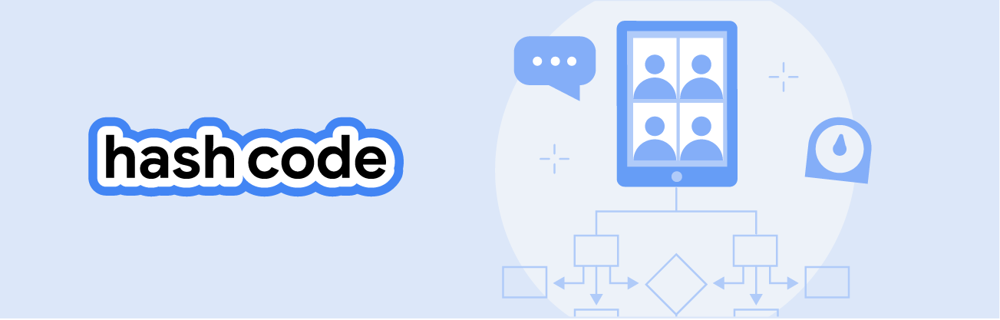

# \# Hash Code 2022

Solutions with code for [Google \# Hash Code 2022](https://codingcompetitions.withgoogle.com/hashcode).

## Qualification Round

### Mentorship and Teamwork

The problem statement can be found [here](Qualification%20Round/README.md).  
Our solution is in the [Qualification Round folder](Qualification%20Round).

See the [README.md](Qualification%20Round/README.md) for a full walkthrough of the problem.

#### Introduction

> Work is so much more fun when we are part of a team! By combining our different skills, we can be more creative, efficient and productive.
> And more importantly, when working together we share... not only pizzas, but also knowledge.
> We can learn from each other, improve our own skills and gain experience.
>
> Teamwork is one of the main ingredients of Hash Code, especially in this challenge!
>
> So, are you up for the challenge?
>
> 
>
> _see the [README.md](Qualification%20Round/README.md) for the complete problem statement._

#### Task

> You are given a list of contributors, who have already mastered various skills, and a list of projects with different skill requirements.
> Contributors can improve their skills by completing projects and can mentor each other to work is roles in which they couldn't succeed on their own.
>
> Your task is to assign contributors to project roles that fit their qualifications and maximize the score for completed projects.
>
> _see the [README.md](Qualification%20Round/README.md) for the complete problem statement._

## Practice Round

### One Pizza

The problem statement can be found [here](Practice%20Round/README.md).  
Our solution is in the [Practice Round folder](Practice%20Round).

See the [README.md](Practice%20Round/README.md) for a full walkthrough of the problem.

#### Introduction

> You are opening a small pizzeria.
> In fact, your pizzeria is so small that you decided to offer only **one type of pizza**.
> Now you need to decide what ingredients to include (peppers? tomatoes? both?).
> 
> 
> 
> _see the [README.md](Practice%20Round/README.md) for the complete problem statement._

#### Task

> Your task is to choose which ingredients to put on your only pizza type, to maximize the number of clients that will visit your pizzeria.
>
> _see the [README.md](Practice%20Round/README.md) for the complete problem statement._

#### Authors
Sebastian Brodehl / [@sbrodehl](https://github.com/sbrodehl)  
Daniel Franzen / [@da-fr](https://github.com/da-fr)

## License

This project is licensed under the Apache License 2.0 - see [LICENSE](LICENSE) for details.
