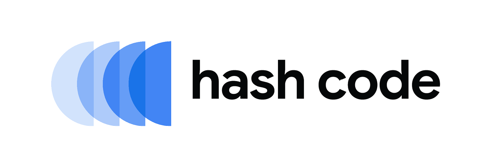

# \# Hash Code 2022

Solutions with code for [Google \# Hash Code 2022](https://codingcompetitions.withgoogle.com/hashcode).

## Online Qualifications

The Online Qualifications take place on Feb 24 2022.

## Practice Round

### One Pizza

The problem statement can be found [here](Practice%20Round/README.md).  
Our solution is in the [Practice Round folder](Practice%20Round).

See the [README.md](Practice%20Round/README.md) for a full walkthrough of the problem.

#### Introduction

> You are opening a small pizzeria.
> In fact, your pizzeria is so small that you decided to offer only **one type of pizza**.
> Now you need to decide what ingredients to include (peppers? tomatoes? both?).
> 
> 
> 
> _see the [README.md](Practice%20Round/README.md) for the complete problem statement._

#### Task

> Your task is to choose which ingredients to put on your only pizza type, to maximize the number of clients that will visit your pizzeria.
>
> _see the [README.md](Practice%20Round/README.md) for the complete problem statement._

## License

This project is licensed under the Apache License 2.0 - see [LICENSE](LICENSE) for details.
